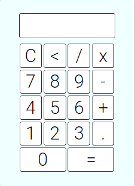

# Calculadora

Calculadora feita com [PHP 7.2](https://www.php.net/), JavaScript, CSS e HTML puro.

O PHP foi usado nesse apenas para facilitar a criação de um servidor.
 Toda lógica do programa é feita em Javascript. 
 Para rodar a aplicação, basta baixar esse arquivo e ter o PHP instalado.

 

## Preparando o ambiente

- Baixe o [PHP](https://www.php.net/manual/pt_BR/install.php)

## Iniciando a aplicação

- Abra o terminal na pasta da aplicação,
- Digite: 'php -S localhost:8000' para iniciar o servidor local,
- Abra o navegador de sua preferência,
- Digite: <http://localhost:8000/>
